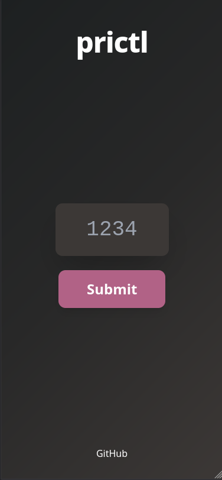

# prictl

prictl is a tool used to control slides in presentations from other devices such as phones, tablets, laptops, or smartwatches. It works with any presentation application and is compatible with Windows, macOS, Linux, and BSD. With prictl, you can easily move forward or backward in slides over your local network.

---

## Features
- Move to next and previous slides
- Works with any presentation software
- Simple to use (just scan the QR code)
- Supports multiple platforms (Windows, Linux, macOS, BSD)

---

## Requirements
- Python 3.x
- [pyautogui](https://pypi.org/project/PyAutoGUI/) (for controlling slides)
- [FastAPI](https://fastapi.tiangolo.com/) (for the HTTP server)
- Local network connection

---

## Installation 

### Prerequisites
- Python 3.8 or higher
- pip (Python package manager)

> ⚠️ Depending on your system, you may need to use `pip3` instead of `pip` and `python3` instead of `python`.

---

### Quick Start
If you just want to get started quickly:
```bash
git clone https://github.com/mateo-rfz/prictl.git
cd prictl/src
pip install -r requirements.txt
python main.py
```

---

### For Windows
1. Make sure Python is installed on your primary device:  
   [Download Python](https://www.python.org/downloads/)

2. Open terminal (CMD/PowerShell) in the `prictl` directory and install dependencies:  
   ```bash
   pip install -r src/requirements.txt
   ```

3. Run prictl:  
   ```bash
   cd src
   python main.py
   ```

---

### For macOS
1. Make sure Python is installed on your device.  
   You can install it with [Homebrew](https://brew.sh/):  

   ```bash
   brew install python3
   ```

2. Install dependencies:  
   ```bash
   pip3 install -r src/requirements.txt
   ```

3. Run prictl:  
   ```bash
   cd src
   python3 main.py
   ```

---

### For Linux 
1. Make sure Python is installed on your primary device

Install Python on your distro:  

Debian/Ubuntu:
```bash 
sudo apt install python3
```

Arch:
```bash 
sudo pacman -S python3 
```

RedHat/Fedora:
```bash 
sudo dnf install python3 
```

2. Open terminal in the `prictl` directory and install dependencies:  
```bash 
pip install -r src/requirements.txt
```

3. Run prictl: 
```bash 
python3 main.py
```

---

### For BSD
1. Make sure Python is installed on your primary device

Install Python on your distro:  

FreeBSD/NetBSD/OpenBSD:
```bash 
sudo pkg install python3
```

2. Open terminal in the `prictl` directory and install dependencies:  
```bash 
pip install -r src/requirements.txt
```

3. Run prictl: 
```bash 
python3 main.py
```


---

## Usage Examples

- Example 1: 

- Example 2:

- Example 3:


> Once the server is running on your main device, open the web page on another device connected to the same local network to control your slides.

---

## Configuration (Optional)
- Default HTTP port: `10001` (can be changed in `main.py` if needed)
- Future options for customizing slide controls

---

## Troubleshooting

- **Devices cannot see each other**: Ensure both devices are on the same local network.  
- **Python errors / dependencies**: Make sure all required packages are installed.  
- **Browser or firewall issues**: Check that the firewall allows connections to the HTTP server port.

---

## Contributing

If you want to contribute:  
- Fork the repository  
- Submit Pull Requests or open Issues  

---

## Contact

- GitHub: [https://github.com/mateo-rfz/](https://github.com/mateo-rfz/)  
- Weblog: [https://mateorfz.ir](https://mateorfz.ir)  
- Email: mahdifeyzolahy@gmail.com  

---

## License

This project is licensed under the **GNU General Public License v3**.

